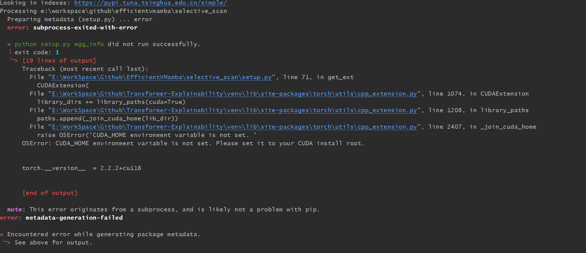
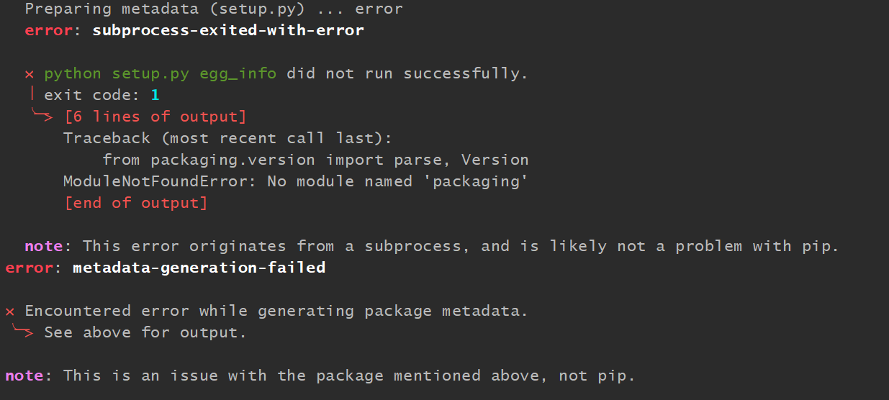
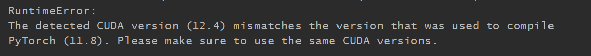
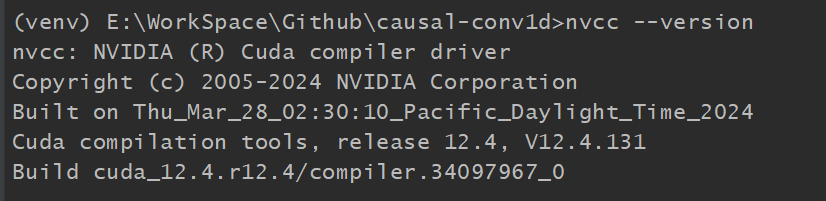
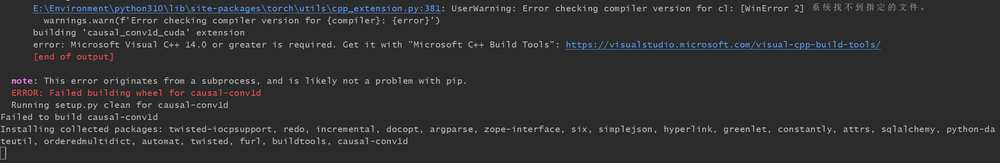
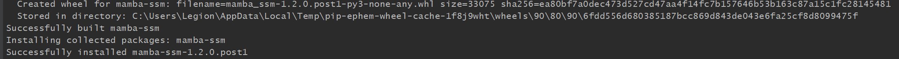

OSError: CUDA_HOME environment variable is not set. Please set it to your CUDA install root.
-> https://zhuanlan.zhihu.com/p/565649540

安装CUDA:
https://blog.csdn.net/Data_Arrow/article/details/134059182

> https://blog.csdn.net/yyywxk/article/details/136071016?spm=1001.2101.3001.6661.1&utm_medium=distribute.pc_relevant_t0.none-task-blog-2~default~CTRLIST~Rate-1-136071016-blog-135918564.235%5Ev43%5Epc_blog_bottom_relevance_base5&depth_1-utm_source=distribute.pc_relevant_t0.none-task-blog-2~default~CTRLIST~Rate-1-136071016-blog-135918564.235%5Ev43%5Epc_blog_bottom_relevance_base5&utm_relevant_index=1

pip install triton-2.0.0-cp310-cp310-win_amd64.whl

->

pip install mamba_ssm

error:

pip install packaging

去安装causal-conv1d
pip install .

之后NCCV检查版本

安装cuda 11.8 之后

继续报错

https://zhuanlan.zhihu.com/p/465461347
安装
success! ->之后去安装mamba-ssm 报错
cd selective_scan pip install .

安装完成了
